# 3DViewer

> Реализация программы для просмотра 3D-моделей в каркасном виде на языке С.
> Модели формата .obj. Есть возможность просматривать их на экране, вращать, масштабироть и перемещать.

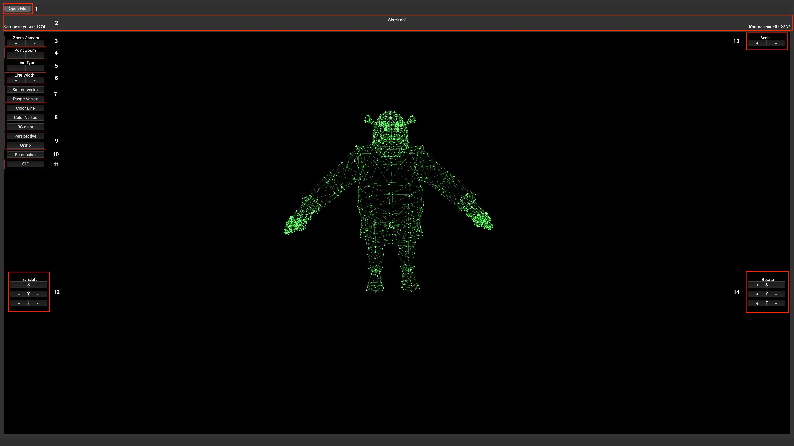

### Кнопки

1) "Open file" - кнопка для выбора файла с моделью  
   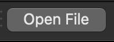
2) Информацию о загруженной модели - название файла, кол-во вершин и ребер
   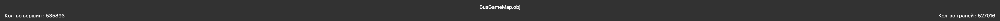

3) "Zoom Camera" - кнопка для изменения масштаба модели за счет движения камеры  

   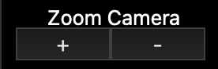
4) "Point zoom" - кнопка для изменения размера вершин  

   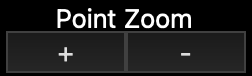
5) "Line Type" - кнопка для выбора типа ребер (сплошная, пунктирная)  

   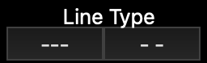
6) "Line Width" - кнопка для изменения толщины ребер  

   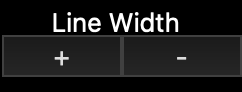
7) "Square Vertex" и "Renge Vertex" - кнопки для отображения вергиш (круг, квадрат)  

   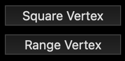
8) "Color Line", "Color Vertex", "BG color" - кнопки выбора цвета для ребер,вершин и фона  

   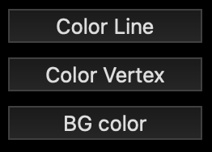
9) "Perspective" и "Ortho" - кнопки изменения типа проекции (параллельная и центральная)  

   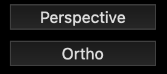
10) "Screenshot" - кнопка для создания скирншота  

    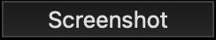
11) "GIF" - кнопка для создание gif  

    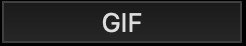
12) "Translete" - кнопки перемещения модели по осям X, Y, Z  

    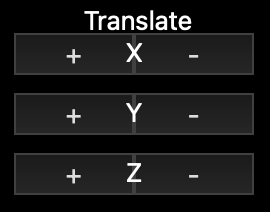
13) "Scale" - кнопка масштабирования модели (так же изменения происходят колесиком мышки)  

    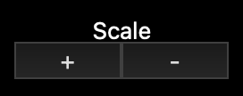
14) "Rotate" - кнопки поворота модели по осям X, Y, Z (так же изменения происходят перемещением курсора при нажатии)  

    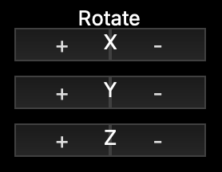   

